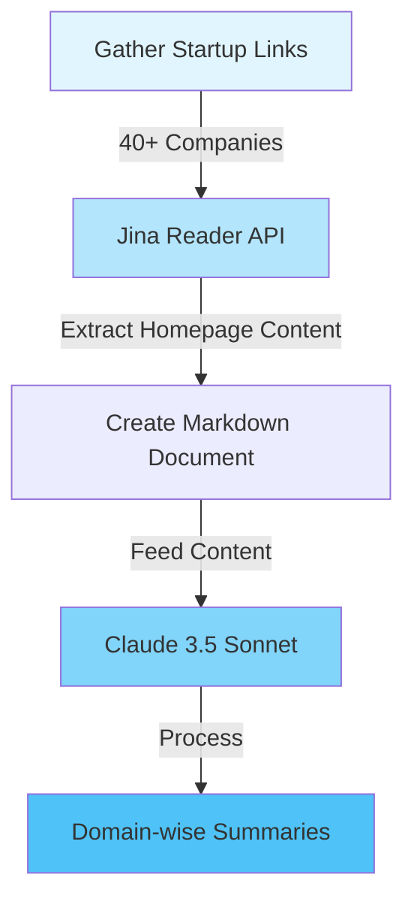

# AI-LLM Startup Industry Analysis Report 2024

- I recently attended [AI Week Bangalore - 2024](https://aiweek.magicball.dev/).
- It showcased 40+ AI/LLM startups, which provided valuable insights into how AI and LLMs are being leveraged across different industries.
- It was fascinating to see the diverse applications and innovative approaches these startups are taking to solve real-world problems.  
- To explore this landscape further, I created this structured analysis documenting these startups, their core offerings, and how they're implementing LLMs.

## Executive Summary

After analyzing the homepage content of 40+ AI-LLM startups, several distinct domains have emerged in the current AI startup landscape. The analysis reveals a strong focus on enterprise applications, with particular emphasis on customer service automation, developer tools, and industry-specific AI solutions.

### Key Trends
1. **Focus on Enterprise Integration**: Most solutions are designed for enterprise deployment with emphasis on seamless integration into existing workflows
2. **Multilingual Capabilities**: Strong emphasis on supporting multiple languages and regional markets
3. **Cost Optimization**: Many solutions focus on reducing operational costs through AI automation
4. **Infrastructure Flexibility**: Support for both cloud and on-premise deployments is common
5. **Real-time Processing**: Emphasis on real-time capabilities and low-latency solutions

## Domain-wise Analysis

### 1. Customer Service & Support Automation
This domain focuses on automating customer interactions through AI agents, primarily targeting enterprise support operations.

| Company | Core Offering | Key Differentiator | Target Audience | Unique Approach |
|---------|---------------|-------------------|-----------------|-----------------|
| [Bolna](https://www.bolna.dev/) | AI voice agents for customer service | Voice-first approach with multi-language support | Enterprise customer service | Natural voice interactions with CRM integration |
| [Sagepilot](https://www.sagepilot.ai/) | AI support agents for customer service | Personalized AI agents that embody brand voice | Enterprise support teams | Multi-channel support automation |
| [HeyReplai](https://www.heyreplai.com/) | AI voice agents for lead qualification | Real-time lead qualification and engagement | Sales teams | Automated lead engagement with voice capabilities |
| [Dexy](https://meetdexy.ai/) | AI SDR for sales automation | Autonomous prospecting and meeting booking | Sales teams | Integrated outbound sales automation |
| [Revrag](https://www.revrag.ai/) | AI-powered sales automation | Hyper-personalized outreach at scale | Revenue teams | Multi-channel sales engagement |

### 2. Developer Tools & Infrastructure
Solutions focused on helping developers build, deploy, and manage AI applications.

| Company | Core Offering | Key Differentiator | Target Audience | Unique Approach |
|---------|---------------|-------------------|-----------------|-----------------|
| [CodeAnt](https://www.codeant.ai/) | AI code review and security | Comprehensive code quality and security analysis | Development teams | Integrated code review and security scanning |
| [Inferless](https://www.inferless.com/) | ML model deployment platform | Quick deployment with cost optimization | ML engineers | Serverless GPU inference |
| [Lightning AI](https://lightning.ai/) | AI development platform | Comprehensive development environment | AI developers | Browser-based development with cloud GPUs |
| [Potpie](https://www.potpie.ai/) | AI agents for codebase analysis | Codebase-aware AI assistance | Developers | Knowledge graph-based code understanding |
| [Truefoundry](https://www.truefoundry.com/) | AI infrastructure platform | Simplified deployment and management | ML teams | Comprehensive MLOps solution |
| [CommandDash](https://commanddash.io/) | AI code agents platform | Library-specific code assistance | Developers | Personalized coding assistance |

### 3. Document Processing & Knowledge Management
Solutions focused on processing, analyzing, and extracting insights from documents and unstructured data.

| Company | Core Offering | Key Differentiator | Target Audience | Unique Approach |
|---------|---------------|-------------------|-----------------|-----------------|
| [Unstract](https://unstract.com/) | LLM-powered ETL for unstructured data | No-code document processing | Enterprise teams | Automated data extraction |
| [Omniparse](https://docs.cognitivelab.in/) | Document parsing and optimization | Multi-format document processing | Enterprises | Comprehensive parsing capabilities |
| [Krux AI](https://www.krux.ai/) | Production-ready RAG systems | Optimized retrieval and generation | Enterprise AI teams | Smart RAG optimization |
| [LlamaIndex](https://www.llamaindex.ai/) | Data framework for LLM applications | Comprehensive data connectivity | AI developers | Extensive integration options |

### 4. Industry-Specific Solutions
AI solutions tailored for specific industries or use cases.

| Company | Core Offering | Key Differentiator | Target Audience | Unique Approach |
|---------|---------------|-------------------|-----------------|-----------------|
| [Testsigma](https://testsigma.com/) | AI-powered test automation | Codeless test automation | QA teams | GenAI-powered testing |
| [OnFinance](https://www.onfinance.ai/) | AI agents for financial services | Explainable AI for finance | Financial institutions | Regulatory compliance focus |
| [Rootally](https://www.rootally.com/) | AI health coach | Personalized health assessments | Healthcare providers | Digital MSK clinic |
| [Umrit](https://www.umrit.health/) | AI health companion | Blood report analysis | Healthcare consumers | Personalized health scoring |
| [MoneyFlo](https://moneyflo.ai/) | Financial insights platform | Data-driven lending decisions | Financial institutions | Multi-source data analysis |

### 5. Enterprise AI Infrastructure & Optimization
Platforms focusing on enterprise AI deployment and optimization.

| Company | Core Offering | Key Differentiator | Target Audience | Unique Approach |
|---------|---------------|-------------------|-----------------|-----------------|
| [Portkey](https://portkey.ai/) | AI development control panel | Comprehensive monitoring and optimization | Enterprise AI teams | Full-stack ops platform |
| [Maxim](https://www.getmaxim.ai/) | GenAI evaluation platform | Enterprise-grade testing framework | AI teams | Comprehensive evaluation suite |
| [DotAgent](https://www.dotagent.ai/) | AI agent optimization platform | Dynamic model matching | Enterprise AI teams | Patent-pending Agent Genome |
| [VectorX](https://vectorxdb.ai/) | Secure vector database | Encrypted vector storage | Enterprise AI teams | Zero network footprint |
| [Fondant](https://fondant.ai/en/latest/) | Data framework for dataset building | Collaborative dataset development | Data teams | Reusable operations |

### 6. Specialized AI Applications
Unique AI applications targeting specific use cases.

| Company | Core Offering | Key Differentiator | Target Audience | Unique Approach |
|---------|---------------|-------------------|-----------------|-----------------|
| [Askiyo](https://askiyo.com/) | Real-time meeting copilot | Meeting assistance and follow-ups | Business professionals | Continuous meeting support |
| [Mazic](https://www.mazic.io/) | AI-powered video creation | Professional video production | Founders & SaaS teams | Automated video editing |
| [Helium](https://gethelium.co/) | AI-powered fashion retail platform | Personalized shopping experiences | Fashion retailers | AI merchandising |
| [LoopX](https://www.loopx.live/) | No-code product experience platform | Quick product prototyping | Software teams | AI-powered development |
| [Sarvam](https://www.sarvam.ai/) | Indian language AI platform | Multi-lingual voice AI | Indian market | Voice-first approach |
| [Zenduty](https://www.zenduty.com/) | Incident management platform | End-to-end response orchestration | DevOps teams | Comprehensive incident management |

## Cross-Domain Patterns

### Common Technological Approaches
1. **LLM Integration**: Most solutions leverage large language models with custom fine-tuning
2. **Multi-modal Processing**: Support for text, voice, and visual data processing
3. **API-first Architecture**: Focus on easy integration with existing systems
4. **Autonomous Agents**: Trend toward self-operating AI agents for various tasks

### Shared Challenges Addressed
1. **Cost Optimization**: Focus on reducing operational costs through AI automation
2. **Integration Complexity**: Simplifying enterprise system integration
3. **Performance Scaling**: Managing resource utilization and costs at scale
4. **Security & Compliance**: Enterprise-grade security and regulatory compliance

### Market Gaps & Opportunities
1. **Mid-market Solutions**: Most solutions target enterprise customers, leaving mid-market underserved
2. **Industry-specific AI**: Room for more specialized solutions in specific industries
3. **Edge Computing**: Limited focus on edge-based AI solutions
4. **AI Governance**: Need for better tools for AI governance and compliance

## Geographic Focus
- Strong representation from Indian startups focusing on local market needs
- Global solutions with multi-language support
- Emphasis on enterprise markets in developed economies

## Market Maturity
- Customer Service Automation: Maturing rapidly with multiple established players
- Developer Tools: Growing market with diverse solutions
- Document Processing: Early maturity with room for specialization
- Industry-Specific Solutions: Emerging with significant growth potential
- Enterprise Infrastructure: Rapidly evolving with focus on optimization

## Conclusion
The AI startup landscape shows a strong focus on enterprise applications with emphasis on practical, production-ready solutions. The trend toward autonomous AI agents and industry-specific solutions indicates a maturing market moving beyond generic AI applications toward more specialized and sophisticated use cases.